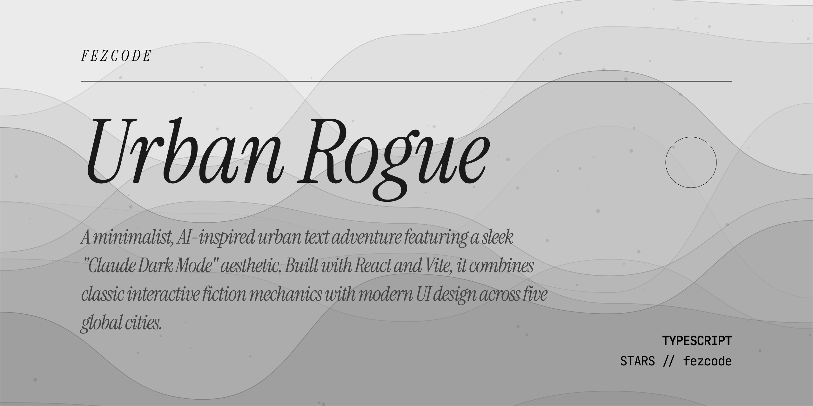

# Urban Rogue

A minimalist, AI-inspired urban text adventure featuring a sleek "Claude Dark Mode" aesthetic. Built with React and Vite, it combines classic interactive fiction mechanics with modern UI design across five global cities.

## Features

- **Sleek UI:** High-contrast dark theme inspired by modern AI interfaces (Claude.ai).
- **Global Transit:** Explore New York, Istanbul, Ankara, Tokyo, and Rome.
- **Classic Parser:** Interact using natural commands (`look`, `go`, `take`, `talk to`, etc.).
- **Dynamic Progression:** Level up your character, upgrade equipment, and manage your inventory.
- **Economy & Combat:** Trade with merchants and survive encounters in the urban sprawl.

## Tech Stack

- **Framework:** React 19 (Vite)
- **Styling:** Vanilla CSS (Modern aesthetic)
- **Engine:** Custom JavaScript Parser
- **State:** React Hooks & Reducer

## Tags

`react` `vite` `roguelike` `text-adventure` `interactive-fiction` `mud` `dark-mode` `minimalist-ui` `urban-rpg` `game-engine` `javascript` `modern-ui` `terminal-game`
